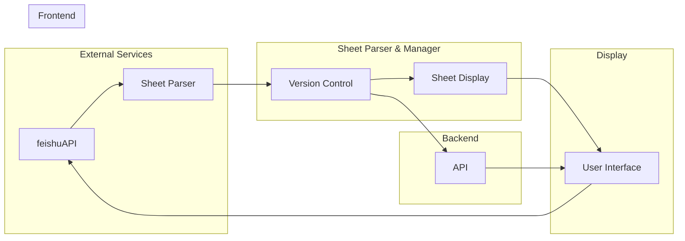
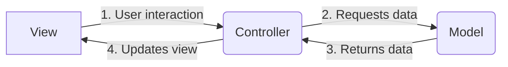

<h1 align="center" style="border-bottom: none">
    <b>
        <a href="https://docker.nsddd.top">feishu-sheet-parser</a><br>
    </b>
</h1>
<h3 align="center" style="border-bottom: none">
      ⭐️  Template for a typical module written on Go.  ⭐️ <br>
<h3>


<p align=center>
<a href="https://goreportcard.com/report/github.com/kubecub/feishu-sheet-parser"></a>
<a href="https://github.com/issues?q=org%25kubecub+is%3Aissue+label%3A%22good+first+issue%22"></a>
<a href="https://github.com/kubecub/feishu-sheet-parser"></a>
<a href="https://join.slack.com/t/kubecub/shared_invite/zt-1se0k2bae-lkYzz0_T~BYh3rjkvlcUqQ"></a>
<a href="https://github.com/kubecub/feishu-sheet-parser/blob/main/LICENSE"></a>
<a href="https://golang.org/"></a>
</p>

</p>

<p align="center">
    <a href="./README.md"><b>English</b></a> •
    <a href="./README_zh-CN.md"><b>中文</b></a> •
    <a href="https://kubecub.github.io/feishu-sheet-parser"><b>Docs</b></a>
</p>

</p>

----


## 🧩 Awesome features

A system that monitors and tracks ESG (Environmental, Social and Governance) disclosures and ratings from various public data sources. It collects ESG data points from sources like Feishu spreadsheets and makes them available through an administrative interface.

## 🛫 Quick start 

> **Note**: You can get started quickly with feishu-sheet-parser.


<details>
  <summary>Work with Makefile</summary>

```bash
❯ make help    # show help
❯ make build   # build binary
```

</details>
<details>
  <summary>Work with actions</summary>

Actions provide handling of PR and issue.
We used the bot @kubbot, It can detect issues in Chinese and translate them to English, and you can interact with it using the command `/comment`.

Comment in an issue:

```bash
❯ /intive
```

</details>
<details>
  <summary>Work with Tools</summary>

```bash
❯ make tools
```

</details>
<details>
  <summary>Use feishu SDK</summary>

Init client
```go
import (
    parsetsdk "github.com/kubecub/feishu-sheet-parser"
)

cli := parsetsdk.MustNewClient("cli_a253xxxxb500b", "6YKq9xxxxpZv6D")
```

Call open interface(CURD)
> example inset
```go
func demo() {
    ctx := context.Background()

    baseToken := "bascntXKzhxxxxxVKPRe"
    tableID := "tbl8xxxxAu"
    fields := map[string]interface{}{
        "multi-line text": "test content",
    }

    record, err := cli.CreateRecord(ctx, baseToken, tableID, fields)
    if err != nil {
        fmt.Printf("createRecord failed, err=%v\n", err)
    } else {
        fmt.Printf("createRecord success, record=%+#v\n", record)
    }
}
```

</details>


## 🕋 architecture diagram


**MVC Architecture Design:**


## 🤖 File Directory Description
```bash
.
├── CONTRIBUTING.md                # Contribution guidelines
├── LICENSE                        # License information
├── Makefile                       # Makefile for building the project
├── README.md                      # Project readme
├── bin                            # Binary files
│   └── main                       # Main binary executable
├── cmd                            # Command-line interface source code
│   └── feishusheet                # Feishusheet CLI source code
├── configs                        # Configuration files
│   └── config.yaml                # YAML configuration file
├── docs                           # Documentation folder
│   └── README.md                  # README for documentation
├── examples                       # Example files
├── go.mod                         # Go module definition file
├── go.sum                         # Go module checksum file
├── internal                       # Internal packages
│   ├── controllers                # Controllers package
│   ├── model                      # Model package
│   ├── service                    # Service package
│   ├── utils                      # Utils package
│   └── views                      # Views package
├── pkg                            # Public packages
│   ├── feishu                     # Feishu package
│   ├── feishusdk                  # Feishu SDK package
│   ├── http                       # HTTP package
│   ├── log                        # Logging package
│   └── version                    # Versioning package
├── scripts                        # Script files
│   ├── boilerplate.txt            # Boilerplate text file
│   ├── build.sh                   # Build script
│   └── githooks                   # Git hooks folder
├── test                           # Test files
│   └── README.md                  # README for tests
└── web                            # Web-related files
```


## 🗓️ community meeting

We welcome everyone to join us and contribute to feishu-sheet-parser, whether you are new to open source or professional. We are committed to promoting an open source culture, so we offer community members neighborhood prizes and reward money in recognition of their contributions. We believe that by working together, we can build a strong community and make valuable open source tools and resources available to more people. So if you are interested in feishu-sheet-parser, please join our community and start contributing your ideas and skills!

We take notes of each [biweekly meeting](https://github.com/kubecub/feishu-sheet-parser/issues/2) in [GitHub discussions](https://github.com/kubecub/feishu-sheet-parser/discussions/categories/meeting), and our minutes are written in [Google Docs](https://docs.google.com/document/d/1nx8MDpuG74NASx081JcCpxPgDITNTpIIos0DS6Vr9GU/edit?usp=sharing).

feishu-sheet-parser maintains a [public roadmap](https://github.com/kubecub/community/tree/main/roadmaps). It gives a a high-level view of the main priorities for the project, the maturity of different features and projects, and how to influence the project direction.

## 🤼‍ Contributing & Development

kubecub Our goal is to build a top-level open source community. We have a set of standards, in the [Community repository](https://github.com/kubecub/community).

If you'd like to contribute to this feishu-sheet-parser repository, please read our [contributor documentation](https://github.com/kubecub/feishu-sheet-parser/blob/main/CONTRIBUTING.md).

Before you start, please make sure your changes are in demand. The best for that is to create a [new discussion](https://github.com/kubecub/feishu-sheet-parser/discussions/new/choose) OR [Slack Communication](https://join.slack.com/t/kubecub/shared_invite/zt-1se0k2bae-lkYzz0_T~BYh3rjkvlcUqQ), or if you find an issue, [report it](https://github.com/kubecub/feishu-sheet-parser/issues/new/choose) first.


## 🚨 License

Sealer is licensed under the Apache License, Version 2.0. See [LICENSE](https://github.com/kubecub/feishu-sheet-parser/tree/main/LICENSE) for the full license text.

[](https://app.fossa.com/projects/git%2Bgithub.com%2Fkubecub%2Ffeishu-sheet-parser?ref=badge_large)


## 🔮 Thanks to our contributors!

<a href="https://github.com/kubecub/feishu-sheet-parser/graphs/contributors">
  
</a>
